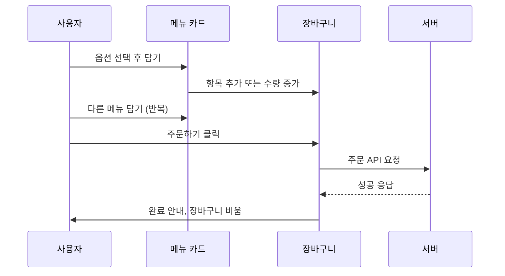
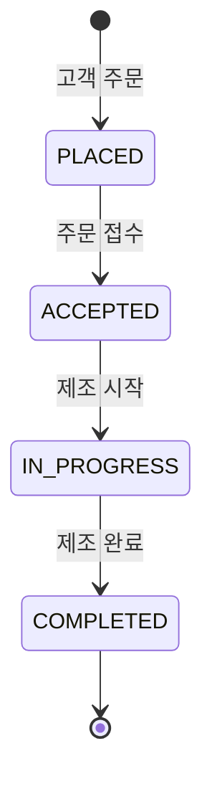
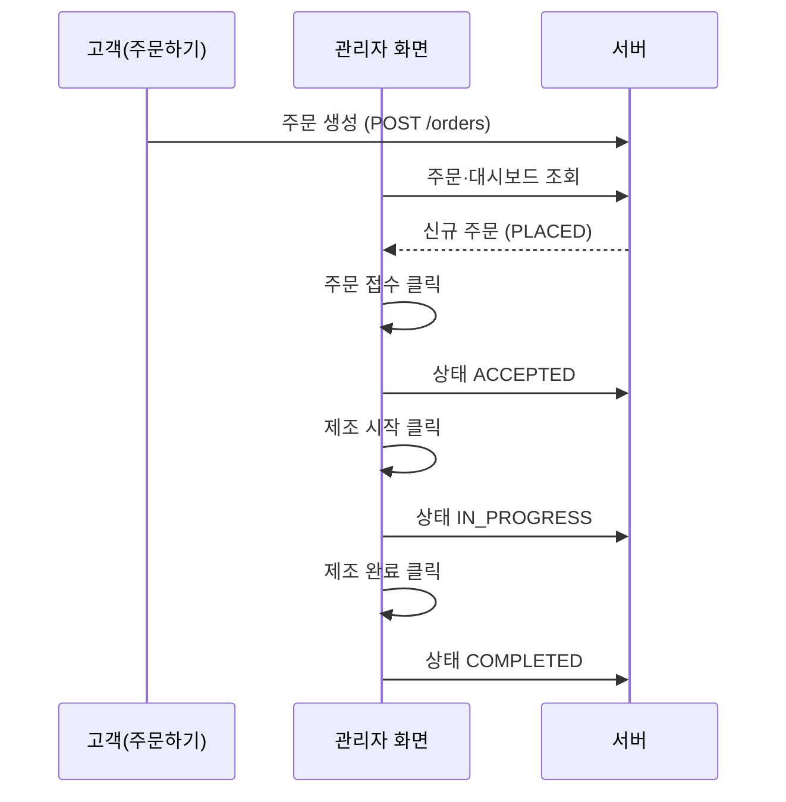

# 커피 주문 앱 PRD

## 1. 프로젝트 개요

### 1.1 프로젝트명
커피 주문 앱

### 1.2 프로젝트 목적
사용자가 커피 메뉴를 주문하고, 관리자가 주문을 관리할 수 있는 간단한 풀스택 웹 앱

### 1.3 개발 범위
- 주문하기 화면(메뉴 선택 및 장바구니 기능)
- 관리자 화면(재고 관리 및 주문 상태 관리)
- 데이터를 생성/조회/수정/삭제할 수 있는 기능

## 2. 기술 스택
- 프런트엔드 : HTML, CSS, 리액트, 자바스크립트
- 백엔드 : Node.js, Express
- 데이터베이스 : PostgreSQL

## 3. 기본 사항
- 프런트엔드와 백엔드를 따로 개발
- 기본적인 웹 기술만 사용
- 학습 목적이므로 사용자 인증이나 결제 기능은 제외
- 메뉴는 커피 메뉴만 있음

---

## 4. 프런트엔드 UI — 주문하기 화면

| 항목 | 내용 |
|------|------|
| 화면명 | 주문하기 |
| 화면 ID | `ORDER` |
| 참고 자료 | 주문하기 화면 와이어프레임 |

### 4.1 화면 개요

#### 4.1.1 목적
고객이 커피 메뉴를 조회하고, 옵션을 선택한 뒤 장바구니에 담아 주문을 접수할 수 있게 한다.

#### 4.1.2 사용자
매장을 방문한 일반 고객 (별도 로그인 없음)

#### 4.1.3 화면 구성 (3영역)
와이어프레임 기준으로 화면은 **헤더**, **메뉴 목록**, **장바구니** 세 영역으로 구성한다.

```
┌─────────────────────────────────────────────────────────┐
│  COZY                    [ 주문하기 ]  [ 관리자 ]        │  ← 헤더
├─────────────────────────────────────────────────────────┤
│  [메뉴 카드]  [메뉴 카드]  [메뉴 카드]  ...                │  ← 메뉴 목록
├─────────────────────────────────────────────────────────┤
│  장바구니                                                │
│  · 항목 목록 · 총 금액 · [주문하기]                        │  ← 장바구니
└─────────────────────────────────────────────────────────┘
```

### 4.2 헤더 영역

#### 4.2.1 구성 요소

| 요소 | 설명 | 비고 |
|------|------|------|
| 브랜드 로고/명 | `COZY` 텍스트, 좌측 상단 | 이미지 로고 대체 가능 |
| 주문하기 탭 | 현재 화면 | 활성 상태 시각 표시 (테두리 등) |
| 관리자 탭 | 관리자 화면으로 이동 | 비활성 시 일반 텍스트/버튼 스타일 |

#### 4.2.2 동작
- **주문하기** 탭: 현재 화면이므로 클릭 시 동작 없음 또는 현재 화면 유지.
- **관리자** 탭: 클릭 시 관리자 화면(§5)으로 라우팅.

#### 4.2.3 UI 상태
- 현재 화면에 해당하는 탭은 **활성(active)** 스타일을 적용한다.
- 비활성 탭은 활성 탭과 구분 가능해야 한다.

### 4.3 메뉴 목록 영역

#### 4.3.1 레이아웃
- 메뉴는 **카드 형태**로 가로 배치한다. (와이어프레임: 3개 카드 한 줄)
- 화면 너비가 좁을 경우 카드는 줄바꿈(wrap)하거나 가로 스크롤 등 반응형 정책을 적용한다. (구체 breakpoint는 구현 단계에서 CSS로 결정)

#### 4.3.2 메뉴 카드 구성 요소

| 요소 | 필수 | 설명 |
|------|------|------|
| 상품 이미지 | O | 이미지 영역. 미등록 시 플레이스홀더 표시 |
| 상품명 | O | 예: 아메리카노(ICE) |
| 가격 | O | 기본 가격, 원 단위 표시 (예: 4,000원) |
| 설명 | O | 한 줄 요약 텍스트 (예: 간단한 설명...) |
| 옵션 | O | 체크박스 형태, 복수 선택 가능 |
| 담기 버튼 | O | 선택 옵션 반영 후 장바구니에 추가 |

#### 4.3.3 초기 메뉴 데이터 (와이어프레임 기준)

| 상품명 | 기본 가격 | 옵션 |
|--------|-----------|------|
| 아메리카노(ICE) | 4,000원 | 샷 추가 (+500원), 시럽 추가 (+0원) |
| 아메리카노(HOT) | 4,000원 | 샷 추가 (+500원), 시럽 추가 (+0원) |
| 카페라떼 | 5,000원 | 샷 추가 (+500원), 시럽 추가 (+0원) |

> 실제 운영 시 메뉴·가격·옵션은 API 또는 정적 데이터에서 로드한다. 위 표는 와이어프레임 기준 **초기 시드 데이터**로 사용한다.

#### 4.3.4 옵션 규칙

| 규칙 ID | 내용 |
|---------|------|
| OPT-01 | 옵션은 체크박스로 표시하며, **0개 이상 복수 선택** 가능하다. |
| OPT-02 | 옵션 라벨에 **추가 금액**을 함께 표시한다. (예: `샷 추가 (+500원)`) |
| OPT-03 | 추가 금액이 0원인 옵션도 동일한 UI 패턴으로 표시한다. (예: `시럽 추가 (+0원)`) |
| OPT-04 | 옵션 선택 여부는 **담기** 시점에만 장바구니에 반영한다. 카드 내에서 실시간으로 장바구니 총액을 바꾸지 않는다. |

#### 4.3.5 가격 계산 (단품)

```
단품 금액 = 메뉴 기본 가격 + Σ(선택한 옵션의 추가 금액)
```

**예시**
- 아메리카노(ICE) + 샷 추가: 4,000 + 500 = **4,500원**
- 아메리카노(HOT), 옵션 없음: **4,000원**
- 카페라떼 + 샷 + 시럽: 5,000 + 500 + 0 = **5,500원**

#### 4.3.6 담기 버튼 동작

| 규칙 ID | 내용 |
|---------|------|
| ADD-01 | 클릭 시 현재 카드의 메뉴 + 선택 옵션 조합을 장바구니에 추가한다. |
| ADD-02 | 장바구니에 **동일 메뉴 + 동일 옵션 조합**이 이미 있으면 새 행을 만들지 않고 **수량을 1 증가**시킨다. |
| ADD-03 | 옵션 조합이 다르면 **별도 행**으로 추가한다. (옵션 집합이 완전히 같을 때만 수량 병합) |
| ADD-04 | 담기 후에도 메뉴 카드의 옵션 체크 상태는 **초기화하지 않고 유지** (연속 담기 편의). 구현 시 팀 합의로 변경 가능. |

**옵션 동일성 판단 예**
- `아메리카노(ICE)` + `{샷 추가}` ≠ `아메리카노(ICE)` + `{}` → 별도 행
- `아메리카노(ICE)` + `{샷 추가}` = `아메리카노(ICE)` + `{샷 추가}` → 수량 +1

### 4.4 장바구니 영역

#### 4.4.1 레이아웃
- 화면 **하단** 고정 또는 스크롤 하단에 배치.
- 영역 제목: **장바구니**
- 구성: **항목 목록** | **총 금액** | **주문하기** 버튼

#### 4.4.2 장바구니 항목 표시 형식

와이어프레임 예시에 맞춘 표시 규칙:

```
{상품명} ({선택 옵션명, 쉼표 구분}) X {수량}     {행 금액}원
```

| 표시 예 | 설명 |
|---------|------|
| `아메리카노(ICE) (샷 추가) X 1` | 옵션 1개 |
| `아메리카노(HOT) X 2` | 옵션 없음 시 괄호 생략 |
| 행 금액 `4,500원` | 단품 금액 × 수량 |

| 규칙 ID | 내용 |
|---------|------|
| CART-01 | 옵션이 없으면 괄호 `(옵션)` 부분을 **생략**한다. |
| CART-02 | 옵션이 여러 개면 괄호 안에 **쉼표로 구분**해 나열한다. (예: `(샷 추가, 시럽 추가)`) |
| CART-03 | 수량은 `X {n}` 형식으로 표시한다. |
| CART-04 | 행 금액 = `단품 금액 × 수량`, 천 단위 구분 쉼표 사용. |

#### 4.4.3 총 금액

| 규칙 ID | 내용 |
|---------|------|
| TOTAL-01 | 라벨: **총 금액** (와이어프레임: `총 금액 12,500원`) |
| TOTAL-02 | 총 금액 = 모든 장바구니 행의 행 금액 합 |
| TOTAL-03 | 장바구니가 비어 있으면 **0원**으로 표시 |
| TOTAL-04 | 메뉴 담기·수량 변경 시 **즉시 재계산**하여 반영 |

**와이어프레임 검증 예시**

| 항목 | 단가 | 수량 | 행 금액 |
|------|------|------|---------|
| 아메리카노(ICE) (샷 추가) | 4,500 | 1 | 4,500 |
| 아메리카노(HOT) | 4,000 | 2 | 8,000 |
| **합계** | | | **12,500** |

#### 4.4.4 주문하기 버튼

| 규칙 ID | 내용 |
|---------|------|
| ORDER-01 | 장바구니의 모든 항목을 **주문 요청**으로 서버에 전송한다. |
| ORDER-02 | 장바구니가 **비어 있으면** 버튼 비활성화 또는 클릭 시 안내 메시지 (예: "담은 메뉴가 없습니다") |
| ORDER-03 | 주문 성공 시 장바구니 **초기화** 및 완료 안내 (토스트/알림 등 — UX는 구현 시 결정) |
| ORDER-04 | 주문 실패 시 장바구니 유지, 오류 메시지 표시 |

#### 4.4.5 장바구니 편집 (와이어프레임 미표시, 권장)

와이어프레임에는 수량 감소·항목 삭제 UI가 없으나, 학습/운영 편의를 위해 다음을 **권장**한다. (필수 여부는 스프린트에서 결정)

| 기능 | 설명 |
|------|------|
| 수량 감소 | 동일 행 수량 1 감소, 0이 되면 행 삭제 |
| 항목 삭제 | 해당 행 제거 |
| 전체 비우기 | 선택 사항 |

> 1차 구현은 와이어프레임 범위(담기 + 주문하기)만으로도 무방하다.

### 4.5 사용자 시나리오

#### 4.5.1 기본 주문 흐름



#### 4.5.2 시나리오 목록

| ID | 시나리오 | 기대 결과 |
|----|----------|-----------|
| US-01 | 옵션 없이 메뉴 담기 | 장바구니에 상품명 + 수량 1 표시, 행 금액 = 기본 가격 |
| US-02 | 샷 추가 후 담기 | 행에 `(샷 추가)` 표시, 행 금액에 +500원 반영 |
| US-03 | 동일 메뉴·동일 옵션 재담기 | 새 행 없이 수량만 증가 |
| US-04 | 동일 메뉴·다른 옵션 담기 | 별도 행 추가 |
| US-05 | 여러 메뉴 담은 뒤 주문하기 | 총 금액 합산 후 서버 전송, 성공 시 장바구니 비움 |
| US-06 | 빈 장바구니에서 주문하기 | 주문 불가, 안내 표시 |

### 4.6 화면 상태

#### 4.6.1 로딩
- 메뉴 목록 API 호출 중: 메뉴 영역에 로딩 표시 (스켈레톤 또는 스피너)
- 주문 제출 중: **주문하기** 버튼 비활성 + 로딩 표시 (중복 제출 방지)

#### 4.6.2 빈 상태
- 메뉴 0건: "등록된 메뉴가 없습니다" 등 안내 (관리자에서 등록 유도 문구 가능)
- 장바구니 0건: 항목 목록 영역 비움, 총 금액 0원

#### 4.6.3 오류
- 메뉴 조회 실패: 재시도 안내
- 주문 실패: 서버 메시지 또는 기본 오류 문구, 장바구니 데이터 유지

### 4.7 데이터 모델 (프런트엔드 관점)

#### 4.7.1 메뉴 (Menu)

```ts
interface MenuOption {
  id: string;
  name: string;       // 예: "샷 추가"
  extraPrice: number; // 예: 500
}

interface Menu {
  id: string;
  name: string;
  price: number;
  description: string;
  imageUrl?: string;
  options: MenuOption[];
}
```

#### 4.7.2 장바구니 항목 (CartItem)

```ts
interface CartItem {
  menuId: string;
  menuName: string;
  basePrice: number;
  selectedOptions: MenuOption[]; // 순서 무관, 집합으로 동일성 비교
  quantity: number;
  unitPrice: number;  // basePrice + options 합
  lineTotal: number;  // unitPrice * quantity
}
```

#### 4.7.3 주문 요청 (OrderPayload) — API 연동 시

```ts
interface OrderItemPayload {
  menuId: string;
  quantity: number;
  optionIds: string[];
}

interface OrderPayload {
  items: OrderItemPayload[];
  totalAmount: number;
}
```

### 4.8 API 연동 (참고)

백엔드는 별도 개발한다. 주문하기 화면에서 예상하는 API는 다음과 같다. (엔드포인트·스키마는 백엔드 PRD에서 확정)

| 용도 | 메서드 | 설명 |
|------|--------|------|
| 메뉴 목록 조회 | `GET /menus` | 판매 중 메뉴 + 옵션 + 가격 |
| 주문 생성 | `POST /orders` | 장바구니 스냅샷 전송 |

**주문 요청 시 서버 검증 권장**
- 클라이언트 `totalAmount`와 서버 재계산 금액 일치 여부
- 메뉴·옵션 ID 유효성
- (추후) 재고 부족 시 4xx 응답

### 4.9 비기능 요구사항

| 항목 | 요구 |
|------|------|
| 접근성 | 버튼·체크박스에 레이블 연결, 키보드 포커스 가능 |
| 표시 | 금액은 한국 로케일 천 단위 구분 (`toLocaleString('ko-KR')`) |
| 인증/결제 | 없음 (§3 기본 사항) |
| 브라우저 | 최신 Chrome 기준 동작, 모바일 뷰 고려 |

### 4.10 수용 기준 (Acceptance Criteria)

- [ ] 헤더에 `COZY`, `주문하기`(활성), `관리자` 탭이 와이어프레임과 동일한 역할로 표시된다.
- [ ] 와이어프레임 3종 메뉴가 카드 UI로 표시되고, 각 카드에 이미지·이름·가격·설명·옵션·담기가 있다.
- [ ] 옵션 선택에 따라 단품 금액이 올바르게 계산된다.
- [ ] 담기 시 동일 메뉴+옵션은 수량이 합쳐지고, 다르면 별도 행이 생긴다.
- [ ] 장바구니에 항목·수량·행 금액·총 금액이 와이어프레임 형식으로 표시된다.
- [ ] 와이어프레임 예시(4,500 + 8,000 = 12,500)와 동일한 합산이 된다.
- [ ] 주문하기 클릭 시 주문 API가 호출되고, 성공 시 장바구니가 비워진다.
- [ ] 빈 장바구니에서는 주문할 수 없다.
- [ ] 관리자 탭 클릭 시 관리자 화면으로 이동한다.

### 4.11 범위 외 (Out of Scope)

- 관리자 화면 UI·기능 (§5에 정의, 로그인·취소·통계 등은 §5.12 범위 외)
- 사용자 로그인·회원가입
- 결제 PG 연동
- 주문 내역 조회·취소 (고객용)
- 메뉴 CRUD (관리자 화면에서 처리)

### 4.12 오픈 이슈

| # | 질문 | 비고 |
|---|------|------|
| OI-01 | 장바구니에서 수량 감소/삭제 UI를 1차에 포함할지 | §4.4.5 권장 사항 |
| OI-02 | 담기 후 옵션 체크박스 초기화 여부 | §4.3.6 ADD-04 기본: 유지 |
| OI-03 | 메뉴·옵션 데이터 소스 (정적 JSON vs API) | 백엔드 일정에 따름 |
| OI-04 | 주문 완료 후 UX (모달 vs 토스트 vs 페이지 이동) | 구현 단계 결정 |

---

## 5. 프런트엔드 UI — 관리자 화면

| 항목 | 내용 |
|------|------|
| 화면명 | 관리자 |
| 화면 ID | `ADMIN` |
| 참고 자료 | 관리자 화면 와이어프레임 |

### 5.1 화면 개요

#### 5.1.1 목적
매장 관리자가 **주문 현황을 파악**하고, **재고를 조정**하며, **주문 상태를 단계별로 변경**할 수 있게 한다.

#### 5.1.2 사용자
매장 관리자 (별도 로그인 없음)

#### 5.1.3 화면 구성 (4영역)
와이어프레임 기준으로 화면은 **헤더**, **관리자 대시보드**, **재고 현황**, **주문 현황** 네 영역으로 구성한다.

```
┌─────────────────────────────────────────────────────────┐
│  COZY                    [ 주문하기 ]  [ 관리자 ]        │  ← 헤더 (관리자 활성)
├─────────────────────────────────────────────────────────┤
│  관리자 대시보드                                         │
│  총 주문 N / 주문 접수 N / 제조 중 N / 제조 완료 N        │  ← 대시보드
├─────────────────────────────────────────────────────────┤
│  재고 현황                                               │
│  [메뉴 카드 +/-]  [메뉴 카드 +/-]  ...                   │  ← 재고
├─────────────────────────────────────────────────────────┤
│  주문 현황                                               │
│  · 주문 목록 (시각·항목·금액·상태 변경 버튼)              │  ← 주문
└─────────────────────────────────────────────────────────┘
```

### 5.2 헤더 영역

§4.2와 동일한 공통 헤더를 사용한다. 관리자 화면에서는 **관리자** 탭이 활성(active) 상태이다.

| 요소 | 동작 |
|------|------|
| 주문하기 탭 | 주문하기 화면(§4)으로 이동 |
| 관리자 탭 | 현재 화면 유지 |

### 5.3 관리자 대시보드 영역

#### 5.3.1 구성
- 영역 제목: **관리자 대시보드**
- 한 줄에 네 가지 지표를 **슬래시(`/`)로 구분**해 표시한다.

```
총 주문 {n} / 주문 접수 {n} / 제조 중 {n} / 제조 완료 {n}
```

#### 5.3.2 지표 정의

| 지표 | 설명 | 집계 대상 |
|------|------|-----------|
| 총 주문 | 접수된 전체 주문 건수 | 취소·삭제 제외한 **모든 유효 주문** |
| 주문 접수 | 관리자가 접수한 주문 | 상태 `ACCEPTED` |
| 제조 중 | 현재 제조 진행 중인 주문 | 상태 `IN_PROGRESS` |
| 제조 완료 | 제조가 끝난 주문 | 상태 `COMPLETED` |

> 고객이 방금 넣은 **신규 주문**(`PLACED`)은 총 주문에는 포함되며, 아직 관리자가 접수하기 전이면 **주문 접수·제조 중·제조 완료** 건수에는 포함하지 않는다.

#### 5.3.3 갱신 규칙

| 규칙 ID | 내용 |
|---------|------|
| DASH-01 | 주문 상태 변경·신규 주문 유입 시 **즉시 재집계**하여 표시한다. |
| DASH-02 | 화면 진입 시 API로 최신 집계를 조회한다. |
| DASH-03 | (권장) 일정 주기(예: 10~30초) 폴링 또는 WebSocket으로 신규 주문 반영. 1차는 **수동 새로고침 + 상태 변경 시 갱신**만으로도 무방. |

**와이어프레임 검증 예시**

| 지표 | 값 | 의미 |
|------|-----|------|
| 총 주문 | 1 | 유효 주문 1건 |
| 주문 접수 | 1 | 접수 완료 1건 |
| 제조 중 | 0 | 제조 중 0건 |
| 제조 완료 | 0 | 완료 0건 |

### 5.4 재고 현황 영역

#### 5.4.1 구성
- 영역 제목: **재고 현황**
- 메뉴별 **카드**를 가로 배치한다. (와이어프레임: 3개 카드)
- 각 카드: **메뉴명**, **현재 재고 수량**, **`-` / `+` 버튼**

#### 5.4.2 초기 재고 데이터 (와이어프레임 기준)

| 메뉴명 | 초기 재고 |
|--------|-----------|
| 아메리카노 (ICE) | 10개 |
| 아메리카노 (HOT) | 10개 |
| 카페라떼 | 10개 |

> 메뉴명 표기는 주문하기 화면(§4.3.3)과 동일 메뉴를 가리킨다. 공백·괄호 표기 차이는 UI 표시 수준이며, 내부적으로는 동일 `menuId`로 연결한다.

#### 5.4.3 재고 조정 규칙

| 규칙 ID | 내용 |
|---------|------|
| INV-01 | **`+` 클릭**: 해당 메뉴 재고 **+1** |
| INV-02 | **`-` 클릭**: 해당 메뉴 재고 **-1**, 재고가 **0이면 더 이상 감소하지 않음** (0 미만 불가) |
| INV-03 | 변경 즉시 서버에 반영(PATCH/PUT API). 실패 시 이전 값으로 롤백 및 오류 표시 |
| INV-04 | 표시 형식: `{수량}개` (예: `10개`) |

#### 5.4.4 주문과 재고 연동 (권장)

| 규칙 ID | 내용 |
|---------|------|
| INV-05 | (권장) 고객 주문 **제조 시작** 또는 **주문 접수** 시점에 해당 메뉴 재고를 주문 수량만큼 차감 |
| INV-06 | (권장) 재고 부족 시 주문하기 화면에서 해당 메뉴 **품절** 표시 또는 담기 비활성화 — 백엔드·§4 연동 시 구현 |
| INV-07 | 관리자가 `+`로 수동 보충 가능 (입고 반영) |

> 1차 구현은 와이어프레임 범위(**수동 +/- 조정**)만 필수로 하고, 주문 연동 자동 차감은 스프린트에서 결정한다.

### 5.5 주문 현황 영역

#### 5.5.1 구성
- 영역 제목: **주문 현황**
- 주문별 **행(row)** 목록. 최신 주문이 **위쪽**에 오도록 정렬(권장).

#### 5.5.2 주문 행 표시 요소

| 요소 | 필수 | 설명 | 와이어프레임 예 |
|------|------|------|-----------------|
| 주문 시각 | O | 접수·생성 시각 | `7월 31일 13:00` |
| 주문 항목 요약 | O | 메뉴·옵션·수량 | `아메리카노(ICE) x 1` |
| 주문 금액 | O | 해당 주문 총액 | `4,000원` |
| 상태 변경 버튼 | O | 다음 단계로 진행 | `주문 접수` |

**항목 요약 표시 규칙**
- 한 주문에 항목이 여러 개면 **줄바꿈** 또는 **쉼표 구분**으로 모두 표시한다.
- 옵션이 있으면 주문하기 화면(§4.4.2)과 동일하게 괄호 표기. (예: `아메리카노(ICE) (샷 추가) x 1`)
- 금액은 주문 **전체 합계**(모든 항목+옵션 포함).

**시각 표시 형식**
- `M월 D일 HH:mm` (예: `7월 31일 13:00`)
- 구현 시 `toLocaleString('ko-KR', { ... })` 등으로 통일

#### 5.5.3 주문 상태 정의

| 상태 코드 | 표시명 | 설명 |
|-----------|--------|------|
| `PLACED` | (대기) | 고객이 주문 완료, 관리자 미처리 |
| `ACCEPTED` | 주문 접수 | 관리자가 주문을 확인·접수함 |
| `IN_PROGRESS` | 제조 중 | 음료 제조 진행 중 |
| `COMPLETED` | 제조 완료 | 제조 완료, 픽업·전달 가능 |



#### 5.5.4 상태 변경 버튼

버튼 라벨은 **다음에 수행할 동작**을 나타낸다.

| 현재 상태 | 버튼 라벨 | 클릭 후 상태 |
|-----------|-----------|--------------|
| `PLACED` | **주문 접수** | `ACCEPTED` |
| `ACCEPTED` | **제조 시작** | `IN_PROGRESS` |
| `IN_PROGRESS` | **제조 완료** | `COMPLETED` |
| `COMPLETED` | (버튼 없음 또는 비활성) | — |

| 규칙 ID | 내용 |
|---------|------|
| ORD-01 | 버튼 클릭 시 **한 단계만** 전진한다. (건너뛰기 불가) |
| ORD-02 | 상태 변경 API 성공 후 목록·대시보드(§5.3)를 **즉시 갱신**한다. |
| ORD-03 | API 실패 시 상태·UI 유지, 오류 메시지 표시 |
| ORD-04 | `COMPLETED` 주문은 목록에서 **숨김** 또는 **하단·회색 처리** — 1차는 **목록에 유지**해도 무방 (와이어프레임 미정) |

**와이어프레임 예시 해석**
- 주문 1건: `7월 31일 13:00`, `아메리카노(ICE) x 1`, `4,000원`, 버튼 `주문 접수`
- → 상태 `PLACED`인 신규 주문으로 해석한다.

### 5.6 사용자 시나리오

#### 5.6.1 기본 처리 흐름



#### 5.6.2 시나리오 목록

| ID | 시나리오 | 기대 결과 |
|----|----------|-----------|
| AD-01 | 화면 진입 | 대시보드·재고·주문 목록이 최신 데이터로 표시된다 |
| AD-02 | 신규 주문 발생 | 총 주문 수 증가, 주문 현황에 `PLACED` 행 추가, 버튼 `주문 접수` |
| AD-03 | 주문 접수 클릭 | 상태 `ACCEPTED`, 대시보드 **주문 접수** +1 |
| AD-04 | 제조 시작 → 제조 완료 | 대시보드 **제조 중**·**제조 완료** 건수가 단계에 맞게 변경 |
| AD-05 | 재고 `+` 클릭 | 해당 메뉴 재고 +1, 서버 반영 |
| AD-06 | 재고 `0`에서 `-` 클릭 | 재고 변화 없음 |
| AD-07 | 주문하기 탭 이동 | §4 주문하기 화면으로 전환 |

### 5.7 화면 상태

#### 5.7.1 로딩
- 초기 로드: 대시보드·재고·주문 API 병렬 호출 중 스켈레톤 또는 로딩 표시
- 상태 변경·재고 조정 중: 해당 행/카드 버튼 비활성 (중복 클릭 방지)

#### 5.7.2 빈 상태
- 주문 0건: "접수된 주문이 없습니다" 등 안내
- 재고 데이터 없음: 관리자 시드 또는 API 오류 안내

#### 5.7.3 오류
- API 실패: 재시도 안내, 부분 실패 시 성공한 영역만 표시

### 5.8 데이터 모델 (프런트엔드 관점)

#### 5.8.1 대시보드 집계 (DashboardSummary)

```ts
interface DashboardSummary {
  total: number;      // 총 주문
  accepted: number;   // 주문 접수
  inProgress: number; // 제조 중
  completed: number;  // 제조 완료
}
```

#### 5.8.2 재고 (InventoryItem)

```ts
interface InventoryItem {
  menuId: string;
  menuName: string;
  stock: number; // 0 이상
}
```

#### 5.8.3 관리자용 주문 (AdminOrder)

```ts
type OrderStatus = 'PLACED' | 'ACCEPTED' | 'IN_PROGRESS' | 'COMPLETED';

interface AdminOrderItem {
  menuName: string;
  selectedOptionNames: string[];
  quantity: number;
}

interface AdminOrder {
  id: string;
  createdAt: string;       // ISO 8601
  items: AdminOrderItem[];
  totalAmount: number;
  status: OrderStatus;
}
```

### 5.9 API 연동 (참고)

| 용도 | 메서드 | 설명 |
|------|--------|------|
| 대시보드 집계 | `GET /admin/dashboard` | §5.3.2 네 지표 반환 (또는 주문 목록에서 클라이언트 집계) |
| 재고 목록 | `GET /admin/inventory` | 메뉴별 재고 |
| 재고 수정 | `PATCH /admin/inventory/:menuId` | `{ stock: number }` 또는 `{ delta: ±1 }` |
| 주문 목록 | `GET /admin/orders` | 상태·시각 포함, 최신순 |
| 주문 상태 변경 | `PATCH /admin/orders/:orderId/status` | `{ status: OrderStatus }` |

**상태 변경 요청 예**
- `PLACED` → `ACCEPTED`: body `{ "status": "ACCEPTED" }`
- 서버는 **허용된 다음 상태만** 수용 (잘못된 전이는 400)

### 5.10 비기능 요구사항

| 항목 | 요구 |
|------|------|
| 표시 | 금액·수량·날짜 한국 로케일 (§4.9와 동일) |
| 접근성 | `+`/`-` 및 상태 버튼에 스크린리더 레이블 |
| 인증 | 없음 (§3) — 실서비스 시 관리자 인증은 범위 외 |
| 반응형 | 재고 카드·주문 목록은 좁은 화면에서 세로 스택 |

### 5.11 수용 기준 (Acceptance Criteria)

- [ ] 헤더에 `COZY`, `주문하기`, `관리자`(활성) 탭이 표시되고 주문하기로 이동할 수 있다.
- [ ] 대시보드에 `총 주문 / 주문 접수 / 제조 중 / 제조 완료`가 슬래시 형식으로 표시된다.
- [ ] 와이어프레임 3종 메뉴 재고가 카드 UI로 표시되고 `+`/`-`로 수량을 조정할 수 있다.
- [ ] 재고는 0 미만으로 내려가지 않는다.
- [ ] 주문 현황에 시각·항목 요약·금액·상태 변경 버튼이 표시된다.
- [ ] `PLACED` 주문에 `주문 접수` 버튼이 보이고, 클릭 시 `ACCEPTED`로 바뀐다.
- [ ] 이후 `제조 시작` → `IN_PROGRESS`, `제조 완료` → `COMPLETED`로 순차 전환된다.
- [ ] 상태 변경 시 대시보드 숫자가 올바르게 갱신된다.
- [ ] 주문하기(§4)에서 생성한 주문이 관리자 주문 현황에 나타난다.

### 5.12 범위 외 (Out of Scope)

- 관리자 로그인·권한 관리
- 주문 취소·환불
- 매출·통계 리포트 (일/월 집계 차트 등)
- 메뉴·가격 CRUD (별도 기능으로 확장 가능)
- 알림음·푸시 (신규 주문 알림)

### 5.13 오픈 이슈

| # | 질문 | 비고 |
|---|------|------|
| OI-A01 | `COMPLETED` 주문을 목록에서 숨길지 유지할지 | §5.5.4 ORD-04 |
| OI-A02 | 주문 시 재고 자동 차감 시점 (접수 vs 제조 시작) | §5.4.4 INV-05 |
| OI-A03 | 신규 주문 실시간 반영 방식 (폴링 vs WebSocket) | §5.3.3 DASH-03 |
| OI-A04 | 여러 항목 주문 시 목록 UI (한 줄 요약 vs 펼침) | §5.5.2 |
